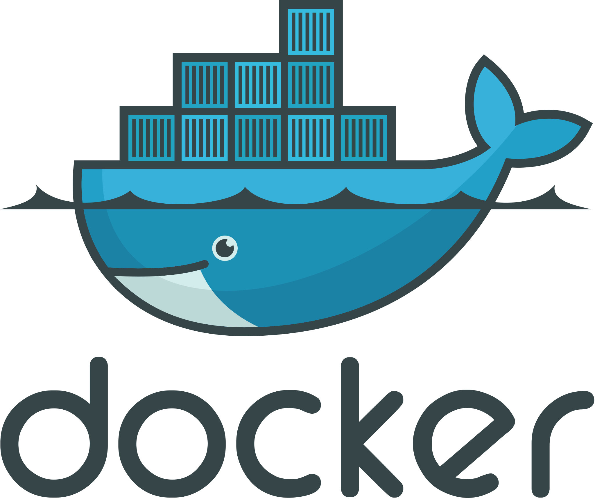
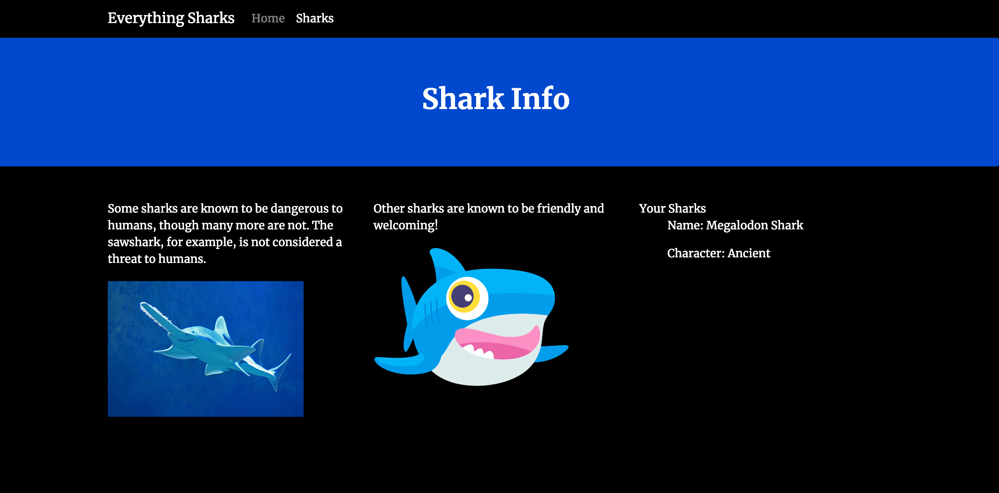

# Everything Sharks 
## Create docker containers with nodejs and mongodb

Project code for tutorial on integrating MongoDB into Node.js application using Mongoose: https://www.digitalocean.com/community/tutorials/how-to-integrate-mongodb-with-your-node-application


## Requisites

Just Docker and Docker Compose



## Usage

### Starting
In your terminal run:

```
docker-compose up -d
```

In your browser [http://localhost] there should be a screen like this: 


To verify mongo is running correct, just fill the form:


To see the registers save in mongo:




### Stoping
```
docker-compose down
```


